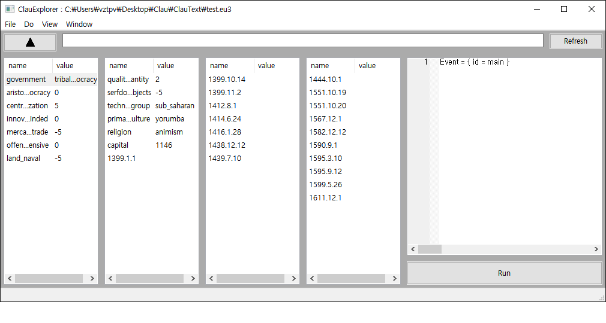

# EU3ToVIC2 ( Experimental Project, For Testing My ClauText API )
  EU3 to VIC2 Using Idhrendur/paradoxGameConverters(https://github.com/Idhrendur/paradoxGameConverters/tree/master/EU3ToV2) 
  and My ClauTextAPI?
# To Do / DOONE
  1. DONE - Loading Savefile -> Using ClauText API(Parallel Loading Savefile)
  2. DONE - over? date(>1836.1.1) processing. using ClauTextAPI? or limit? in date`s constructor?
  3. DONE - remove boost, (oiriginal)object, (original)parser.
  4. C++17? (winapi -> filesystem?)
  5. DONE? - using namespace std; => std::set, std::vector, ...
# Used Tools
  1. ClauEdit (https://github.com/ClauText/ClauExplorer) - To Explore savegame file data.
  
